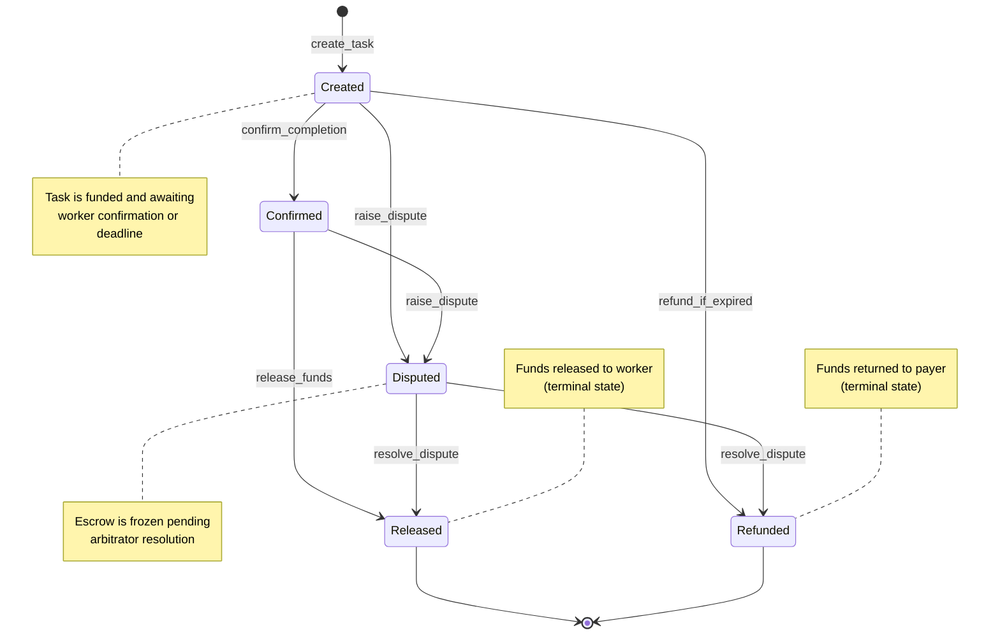

# Truvo

A payment settlement layer connecting Stellar's agentic payment protocols to Anchor off-ramp infrastructure. Truvo enables autonomous AI agents to transact seamlessly on-chain and settle payments directly to real-world recipients in local currencies.

## Status

**Deployed to Testnet** — The core Truvo Soroban escrow smart contract is deployed and operational on the Stellar Testnet:
- **Contract ID**: `CA2FRXSOJ7ZNL2OZLADGQEC64D72K3BFWPUBCVKQQGDQLSA54IN3G2PF`
- **Network**: Stellar Testnet (`https://soroban-testnet.stellar.org`)
- **Explorer**: [View on Stellar Expert](https://stellar.expert/explorer/testnet/contract/CA2FRXSOJ7ZNL2OZLADGQEC64D72K3BFWPUBCVKQQGDQLSA54IN3G2PF)

### Implemented Features

- [x] Core escrow lifecycle (`create_task`, `confirm_completion`, `release_funds`, `refund_if_expired`)
- [x] Dispute resolution (`raise_dispute`, `resolve_dispute` via arbitrator)
- [x] On-chain events for all state transitions (`task_created`, `task_confirmed`, `task_released`, `task_refunded`, `task_disputed`, `task_resolved`)
- [x] Gas-efficient storage access and compile-time symbols
- [x] TypeScript SDK scaffolding with typed interfaces
- [x] Adversarial test suite (reentrancy protection, double-refund prevention)

## Project Overview

Truvo serves as the payment settlement bridge connecting autonomous AI agent payment rails to Anchor off-ramp infrastructure:
- **Agentic Payments**: Built on Stellar, enabling autonomous agents to execute micro-transactions, escrow deposits, and scheduled payouts.
- **Anchor Off-Ramp Settlement**: Direct connectivity to Stellar Anchor rails (SEP-24 / SEP-31 protocols) for off-ramping into local fiat currencies for human recipients.
- **Trustless & Verifiable**: Soroban smart contracts manage conditional releases, escrow, and settlement verification.

## Task Lifecycle State Machine

The escrow contract enforces a strict state machine for task lifecycle management. The diagram below shows all valid state transitions, including the dispute resolution path added in Session 2.



**State descriptions:**

| State | Description |
|---|---|
| **Created** | Task is funded; awaiting worker confirmation or deadline expiry. |
| **Confirmed** | Worker has submitted proof of completion; funds ready for release. |
| **Released** | Funds released to worker (terminal). |
| **Refunded** | Funds returned to payer (terminal). |
| **Disputed** | Escrow frozen; awaiting arbitrator resolution. |

---

## Architecture

Truvo is structured as a monorepo containing four primary modules:

```text
truvo/
├── contracts/       # Soroban smart contracts written in Rust
├── sdk/             # TypeScript SDK for AI agent and client integration
├── frontend/        # React web application and dashboard interface
└── docs/            # Architecture specifications, documentation, and guides
```

### Modules

- **`contracts/`**: Soroban smart contracts handling escrow, agent authorization, payment routing, and settlement on the Stellar network.
- **`sdk/`**: TypeScript library providing agentic payment interfaces, client bindings, and Anchor off-ramp abstractions.
- **`frontend/`**: React-based dashboard for payment monitoring, recipient onboarding, and settlement analytics.
- **`docs/`**: Technical documentation, SEP integration guides, and architecture specifications.

## Setup

### Prerequisites

- [Rust & Cargo](https://www.rust-lang.org/tools/install) (latest stable)
- [Soroban CLI](https://soroban.stellar.org/docs/getting-started/setup#install-the-soroban-cli)
- [Node.js](https://nodejs.org/) (v18+ recommended)
- [pnpm](https://pnpm.io/) or [npm](https://www.npmjs.com/)

### Getting Started

1. Clone the repository:
   ```bash
   git clone https://github.com/Tech-Aura/Truvo.git
   cd Truvo
   ```

2. Component-specific setup and build instructions will be documented within their respective directories as implementations progress.
