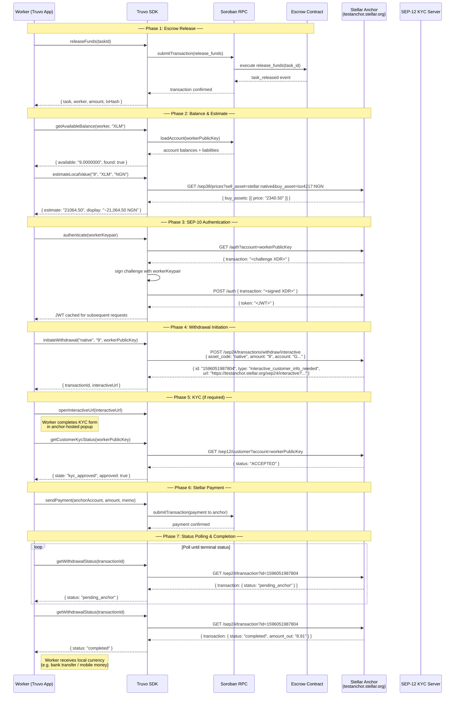

# End-to-End Off-Ramp Flow

This document traces the complete journey from a worker receiving released escrow funds through to cashing out to local currency via a Stellar Anchor. It covers the SDK's role, the Anchor's role, and what the worker sees at each step.

## Mermaid Diagram



## Walkthrough

### Phase 1: Escrow Release

The worker's task has been confirmed on-chain. The `releaseFunds` method on the Truvo SDK calls the escrow contract's `release_funds` function. No authorization is required — any funded account can submit this transaction. The contract emits a `task_released` event containing the worker address and amount, which the SDK parses and returns alongside the updated task state.

At this point the worker's Stellar account holds the released XLM (or other asset).

### Phase 2: Balance Check & Currency Estimate

Before initiating a withdrawal, the worker's app checks how much is actually spendable. The `getAvailableBalance` method reads the worker's on-chain balances via Horizon and subtracts selling liabilities (amounts committed to open offers) to return the true spendable amount.

Next, `estimateLocalValue` queries the Anchor's SEP-38 price oracle to give the worker a rough idea of what their XLM is worth in local currency. This is an estimate only — the Anchor's interactive flow determines the final rate at withdrawal time. The worker sees something like "~21,064.50 NGN" and can decide whether to proceed.

### Phase 3: SEP-10 Authentication

SEP-24 and SEP-12 endpoints require a valid JWT. The SDK handles the SEP-10 flow automatically:

1. Fetches a challenge transaction from the Anchor's auth endpoint.
2. Signs it with the worker's keypair.
3. Submits the signed challenge back.
4. Caches the returned JWT for all subsequent requests.

The worker never sees this flow — it happens silently in the background.

### Phase 4: Withdrawal Initiation

The SDK calls `POST /sep24/transactions/withdraw/interactive` with the asset code, amount, and worker's Stellar account. The Anchor responds with:

- **`id`**: a transaction ID used to track this withdrawal.
- **`url`**: an Anchor-hosted interactive page the worker must open.
- **`type`**: typically `interactive_customer_info_needed`.

The worker's app opens the interactive URL in a webview or popup.

### Phase 5: KYC (if required)

The Anchor's interactive page collects any required KYC information (name, email, etc.). After submission, the SDK can check KYC status via `getCustomerKycStatus`, which calls the SEP-12 `GET /customer` endpoint.

Possible states:

| State | Meaning | App Action |
|-------|---------|------------|
| `kyc_required` | Anchor needs more info | Show the interactive URL to the worker |
| `kyc_pending` | KYC under review | Show a "waiting for verification" state |
| `kyc_approved` | Customer validated | Proceed with withdrawal |
| `kyc_rejected` | KYC failed | Show error/explainer, suggest contacting support |

On testnet, the test anchor typically auto-accepts KYC submissions, so this step is quick. On a production anchor, KYC review could take minutes to hours.

### Phase 6: Stellar Payment

Once the interactive flow is complete, the Anchor provides a withdrawal address and memo. The worker sends a Stellar payment to this address with the required memo. This is the step that actually moves assets from the worker's account to the Anchor.

The SDK does not automate this payment — the worker's wallet app handles it. The SDK's role ends at tracking the status.

### Phase 7: Status Polling & Completion

The worker's app polls `getWithdrawalStatus` at regular intervals (e.g. every 5–10 seconds). The SEP-24 transaction progresses through statuses:

```
incomplete → pending_user_transfer_start → pending_user_transfer_complete
→ pending_anchor → completed
```

Terminal statuses that stop polling: `completed`, `refunded`, `expired`, `error`.

Once `completed` is reached, the worker has received their local currency via the Anchor's off-ramp partner (bank transfer, mobile money, etc.).

### Error Scenarios

| Scenario | SDK Error Type | Action |
|----------|---------------|--------|
| Anchor HTTP 5xx (transient) | Retried automatically | No action needed |
| Anchor HTTP 4xx (permanent) | `TruvoAnchorApiError` | Check request parameters |
| KYC rejected by Anchor | `kyc_rejected` state | Show explainer, contact support |
| Withdrawal failed | `error` status from polling | Show `more_info_url` to the worker |
| Network timeout during polling | Caught gracefully | Retry on next interval |

## Real-World Caveats

- **Fees:** Production anchors charge withdrawal fees (typically 1–3%). The test anchor has fees disabled.
- **Settlement time:** Local currency delivery depends on the Anchor's off-ramp partner. This can range from instant (mobile money) to 1–3 business days (bank transfer).
- **KYC friction:** First-time users may need to wait for KYC review. Some anchors require document uploads.
- **Rate locks:** The price estimate is not a guaranteed rate. The Anchor's interactive flow determines the final rate.
- **Test anchor limits:** The test anchor caps withdrawals at 1–10 units per transaction. Production anchors typically have higher limits.

## SDK Methods Referenced

| Method | Purpose | SEP |
|--------|---------|-----|
| `releaseFunds(taskId)` | Release escrowed funds to worker | On-chain (Soroban) |
| `getAvailableBalance(account, asset)` | Read spendable on-chain balance | Horizon |
| `estimateLocalValue(amount, asset, currency)` | Currency conversion estimate | SEP-38 |
| `authenticate(keypair)` | Obtain SEP-10 JWT | SEP-10 |
| `initiateWithdrawal(asset, amount, account)` | Start SEP-24 withdrawal | SEP-24 |
| `getCustomerKycStatus(account)` | Check KYC status | SEP-12 |
| `getWithdrawalStatus(txId)` | Poll withdrawal progress | SEP-24 |
| `getWithdrawalKycStatus(txId, account)` | Combined withdrawal + KYC state | SEP-24 + SEP-12 |
